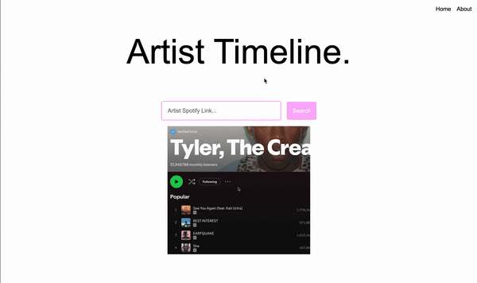

# Artist Timeline
As part of a 24-hour personal challenge, I built a prototype to visualize any musical artist's release history. This project pulls in data from Spotify and Google's Gemini 1.5 Flash to build a scrollable timeline chronicling the artist's major releases accompanied with descriptions of the album.

## Video Demo
\
[Video demo on YouTube here](https://www.youtube.com/watch?v=yEMMuYagO4Q)

## How to Use
1. Download the ZIP file or clone the project
2. Create a .env file in the root directory with the following format, replacing the values with your own API keys. You can get your **free** [Spofity API Key here](https://developer.spotify.com/dashboard) and your **free** [Gemini API Key here](https://aistudio.google.com/app/u/1/apikey).
```
GEMINI_API_KEY=YOUR_GEMINI_KEY_HERE
SPOTIFY_CLIENT_ID=YOUR_SPOTIFY_CLIENT_ID_HERE
SPOTIFY_CLIENT_SECRET=YOUR_SPOTIFY_CLIENT_SECRET_HERE
```

3. In your own Python environment, use `pip install` to install the necessary dependencies.

| Dependency | Relevant Link | Install Command |
| ------------- | ---------- | ------------------ |
| Fast API | [Fast API Homepage](https://fastapi.tiangolo.com/) | `pip install "fastapi[standard]"` |
| Spotipy | [Spotipy Python Library](https://pypi.org/project/spotipy/#documentation) | `pip install spotipy` |
| Gemini | [Gemini Quickstart](https://ai.google.dev/gemini-api/docs/quickstart?authuser=1&lang=python) |`pip install -q -U google-generativeai` |
| Jinja2 | [Jinja2 Install](https://jinja.palletsprojects.com/en/3.1.x/intro/#installation) | `pip install Jinja2`|

4. In the terminal, launch the development server using `fastapi dev main.py`. The development website will be available at [localhost:8000](http://localhost:8000/).

## Features that could be added
- Add birth date to the start of the timeline under the artist name.
- Add death date to end of time line when applicable.
- Remove Deluxe, Instrumentals, and other duplicate types of albums from the timeline.
- Reformat the date on the time line to be more readable.
- Include links to respective Spotify albums or include samples (maybe the most popular song) by embedding the Spotify songs. 
- Add basic stats (Spotify monthly listeners, Spotify followers, etc.) to the first page.
- More scrolling support for non-trackpad users.
- Perhaps implement arrow buttons on the side of the page to move to the next or previous step on the timeline.

